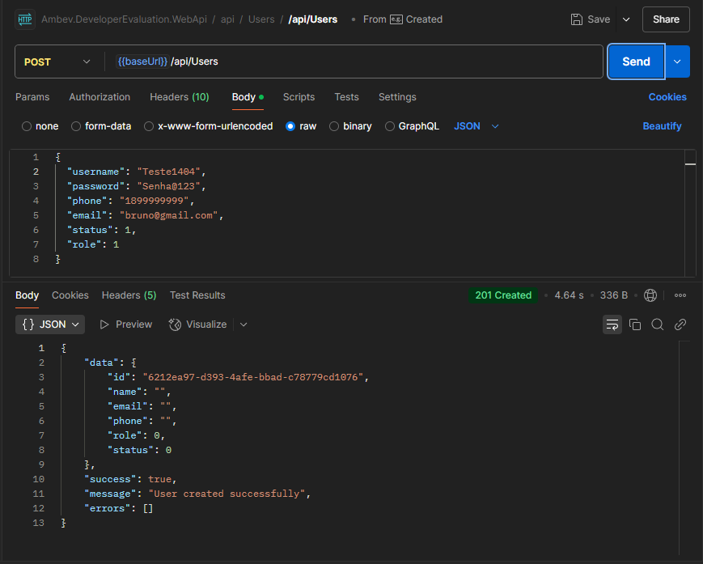
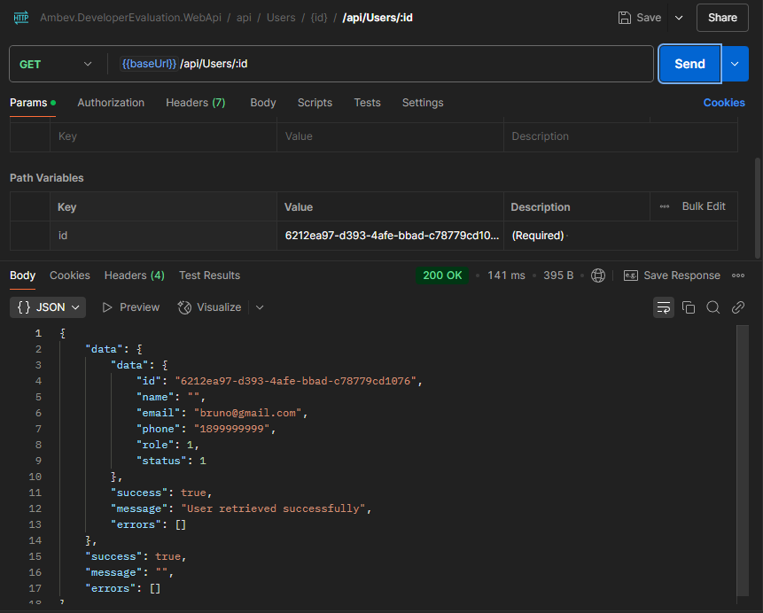
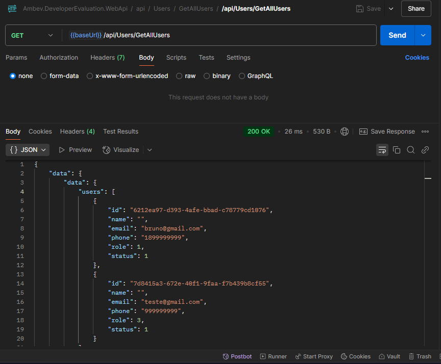

# DesafioAmbev - abi-gth-omnia-developer-evaluation
Desafio técnico Ambev

# Descrição
Este projeto foi desenvolvido usando **C# .NET Core**, com integrações para **RabbitMQ**, **Rebus** e **Entity Framework**. Feito com objetivo de passar em um desafio tecnico proposto pela Ambev. 

## Configuração do Ambiente de Desenvolvimento
### 1. **Pré-requisitos**
Para executar este projeto, certifique-se de que as seguintes ferramentas estão instaladas em seu sistema:
- **.NET Core SDK (v8.0)**: ([Baixe aqui](https://dotnet.microsoft.com/pt-br/download/dotnet/thank-you/sdk-8.0.408-windows-x64-installer))
- **Docker**: Para implantação do ambiente em containers
- **RabbitMQ**: Configuração do sistema de mensageria ([Guia de configuração do RabbitMQ](https://www.rabbitmq.com/documentation.html))
- **PostgreSQL**: Para operações de banco de dados (Não será necessário em caso usar Docker)([Baixe aqui](https://www.enterprisedb.com/downloads/postgres-postgresql-downloads))
- **Postman**: Para testar as APIs ([Documentação do Postman]())

### 2. Configurar Ambiente Docker
2.1 Acessar a pasta onde consta o arquivo `docker-compose.yml`
Certifique-se de navegar até o diretório correto onde está o arquivo `docker-compose.yml`.

2.2 Rodar o comando para iniciar o ambiente (Usando Docker)
Execute o seguinte comando no terminal para construir e iniciar os contêineres:
```
docker-compose up --build -d
```

Caso tenha problemas com o Docker, limpe o cache e tente iniciar os contêineres novamente:

Em ordem, faça os seguintes comandos em terminal
```bash
docker-compose down
docker builder prune
docker system prune -f
```

### 3. **Como Executar**
- 3.1 Migrações de Banco de Dados:
    - Antes de executar a aplicação, configure o banco de dados criando e aplicando as migrações
    - Execute a partir do caminho do projeto **Ambev.DeveloperEvaluation.ORM**
- 3.2 **Instale o Entity Framework** (Caso não tenha):
    ```
    dotnet tool install --global dotnet-ef
    ```
- 3.3 **Aplicar as migrações ao banco de dados**:
    ```
    dotnet ef database update
    ```    
- 3.4 **Criar uma nova migração** (Caso criar uma nova entidade):
    ```
    dotnet ef migrations add <NomeDaMigracao>
    ```


### 4. **Para visualizar as tabelas via Docker**: 
- 4.1 Via terminal, entre no container do PostgreSQL:
    ```
    docker exec -it ambev_developer_evaluation_database bash
    ```
- 4.2 Acesse o banco de dados com psql:
    ```
    psql -U developer -d developer_evaluation
    ``` 
- 4.3 Liste todas as tabelas do schema público:
    ```
    \dt public.*
    ```
- 4.4 Para ver uma tabela em espeficio só fazer consultar via SQL:
    ```
    SELECT * FROM "Users";
    ```
- 4.5 Para sair do psql:
    ```
    \q
    ```


### 5. Executando a Aplicação
Certifique-se de que o arquivo `.csproj` correto esteja especificado na opção `--project`, se necessário.

5.1 Navegue até o projeto WebApi:
    ```bash
    cd template/backend/src/Ambev.DeveloperEvaluation.WebApi
    ```

5.2 Execute a aplicação:
    ```bash
    dotnet run
    ```

A API estará disponível, geralmente, em:
- `http://localhost:5000` ou 
- `https://localhost:5001`

Swagger disponivel em: 
- `http://localhost:5000/swagger/index.html`

Verifique a saída do console para confirmar o endereço exato.

## APIs da Aplicação
### APIs Planejadas:
- **API de Autenticação**: Gerencia login via nome de usuário (não e-mail).
- **API de Produtos**: Busca informações de produtos e gerencia estoque.
- **API de Usuários**: Gerencia cadastro, atualização e funções de usuários.
- **API de Vendas**: Mencionada na documentação, mas precisa ser alinhada com os requisitos da primeira página.


## Problemas Comuns e Esclarecimentos
1. **Detalhes de Autenticação**:
   - O nome de usuário é o método preferido de autenticação.
   - Autenticação por e-mail não é suportada.


## Documentação do Postman
Para testes detalhados e exemplos de APIs, consulte a [Deixar o link aqui].

## Dependências
### Tecnologias Principais
- **C# .NET Core 8**: Framework para construção da aplicação
- **Entity Framework**: ORM para interações com o banco de dados
- **RabbitMQ**: Sistema de mensageria para comunicação (Não implementado)
- **Rebus**: Biblioteca para fluxos de trabalho baseados em mensagens
- **PostgreSQL**: Banco de Dados Relacional
- **Docker**: Containerização da aplicação e seus serviços para facilitar o desenvolvimento e implantação em diferentes ambientes


## Observações Adicionais
- Certifique-se de que as dependencias de ambiente estejam instaladas na versão correta e funcionando.
- Certifique-se de que o RabbitMQ esteja em execução antes de iniciar a aplicação.
- Alinhe-se com as especificações do cliente para a criação das APIs (autenticação, produtos, usuários e possivelmente vendas).


## Controle de Releases
v0.1: Versão inicial não estável
v0.2: Versão com ambiente e conexão estáveis (CreateUser, GetUserById e GetAllUsers)

## Testes Funcionais

1. Criação de Usuario


2. Listagem de Usuario pelo Id


2.1 Listagem de todos Usuarios


